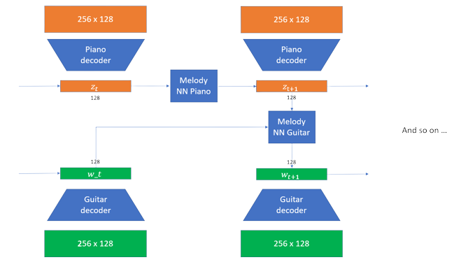

# ai-music-generator

## Introduction

In this project, we set ourselves the goal of exploring as many possibilities as possible for generating music and interpreting our models as best we could. Several approaches are proposed, ranging from predicting the most likely note after a given sequence of notes to generating a piece of music with several instruments. The two main difficulties were the following: 
* The high dimensionality of the problem which led us to use very large datasets
* The generation of a real new melody and not just a sequence of redundant notes

## Dataset

We worked with the data: [Lakh Pianoroll Dataset](https://salu133445.github.io/lakh-pianoroll-dataset/). We kept the cleaned data "lpd_5/lpd_5_cleansed". We can find in this dataset 21,425 multitrack pianorolls. From this data, we extracted for each piece the tracks of 5 instruments where possible. These instruments are the piano, the guitar, the bass, the strings and the drums. Thus, a song is represented by a dictionary whose keys are the instrument names and whose values are the tracks. If an instrument is not represented, we assign the value "None" in the dictionary, otherwise the track is represented by a matrix of size n x 128 where n corresponds to the number of time steps in the song and 128 the number of possible notes. For smaller models and with fewer ambitions than generating entire pieces of music, we used the [music21](https://web.mit.edu/music21/) library from which we were able to extract the Bach pieces.

Finally, in both cases, a note will be represented by its velocity which is an integer between 1 and 127. 

## Sequence to one pitch

Here we use the Bach pieces to train our models. Our first approach was to use an LSTM on a sequence of notes of size 64 to predict the next most appropriate note using a softmax layer. The work done is available on the notebook **SimpleLSTM**. The results lacked creativity, the sound generated was a soulless succession of musical notes. So we tried to improve our model by using variational auto encoder. We also tried to improve the sequence processing by comparing the use of LSTMs and convolution layers in the **SimpleLSTM+VAE** and **SimpleCONV+VAE** notebooks. The results were much more pleasant to listen to. However, these models only allow one track of an instrument to be played with one hand (2 notes cannot be played at the same time). We will now work on models capable of generating multiple instrument tracks where notes can be played at the same time.

## Music generation

We will now use the Lakh Pianoroll dataset. We had the idea of using autoencoders based on convolution layers to reduce the size of our problem. To do this, we divided the tracks of the chunks into window sequences of size 256 (time step). The goal was to compress matrices of size 256 x 128 into a latent space of size 128. The work is available in the notebook **WindowAutoEncoder**. We then built models that from a latent space vector at time t predict the vector at time t+1. To force the instruments to obey the same melody to mix correctly, we opted for the following strategy: 
* Train a model to generate a latent vector $z_{t+1}$ from $z_t$ corresponding to the piano, which is therefore the central element of the music generation
* Train the other models corresponding to the instruments taking as input the latent vector $w_t$ and $z_{t+1}$ to predict $w_{t+1}$ in order to best fit the piano track.

Here is an illustration of the generation of a piece (the code is available on the notebook **MelodyNNs**): 

